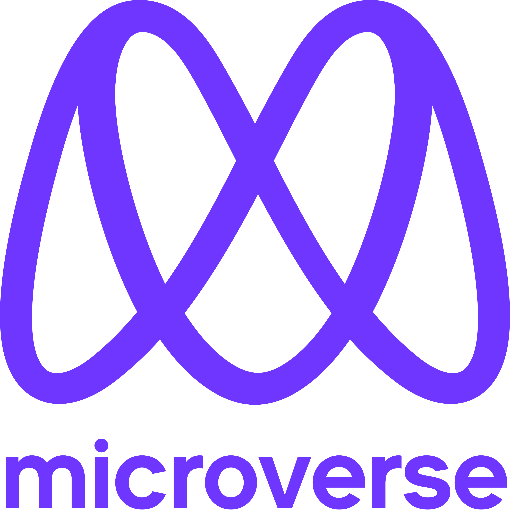

<a name="readme-top"></a>

<div align="center">

  
  <br/>

  <!-- <h3><b>Wizzy Collection</b></h3> -->

</div>

<!-- TABLE OF CONTENTS -->

# 📗 Table of Contents

- [📖 About the Project](#about-project)
  - [🛠 Built With](#built-with)
    - [Tech Stack](#tech-stack)
    - [Key Features](#key-features)
  - [🚀 Live Demo](#live-demo)
- [💻 Getting Started](#getting-started)
  - [Setup](#setup)
  - [Prerequisites](#prerequisites)
  <!-- - [Install](#install) -->
  - [Usage](#usage)
  <!-- - [Run tests](#run-tests) -->
  - [Deployment](#triangular_flag_on_post-deployment)
- [👥 Authors](#authors)
<!-- - [🔭 Future Features](#future-features) -->
- [🤝 Contributing](#contributing)
- [⭐️ Show your support](#support)
- [🙏 Acknowledgements](#acknowledgements)
<!-- - [❓ FAQ](#faq) -->
- [📝 License](#license)

<!-- PROJECT DESCRIPTION -->

# 📖 [Wizzy-beauty] <a name="about-project"></a>

<!-- > Describe your project in 1 or 2 sentences. -->

**[Hello-Microverse]** Just a simple template for my first project at Microverse

## 🛠 Built With <a name="built-with"></a>

### Tech Stack <a name="tech-stack"></a>

<!-- > Describe the tech stack and include only the relevant sections that apply to your project. -->

<details>
  <summary>Client</summary>
  <ul>
    <li><a href="https://html.com/">HTML</a></li>
    <li><a href="https://www.w3schools.com/css/">CSS</a>
  </ul>
</details>

<!-- <details>
  <summary>Server</summary>
  <ul>
    <li><a href="https://expressjs.com/">Express.js</a></li>
  </ul>
</details>

<details>
<summary>Database</summary>
  <ul>
    <li><a href="https://www.postgresql.org/">PostgreSQL</a></li>
  </ul>
</details> -->

<!-- Features -->

### Key Features <a name="key-features"></a>

<!-- > Describe between 1-3 key features of the application. -->

- **[Just show hello Microverse]**
<!-- - **[key_feature_3]** -->

<p align="right">(<a href="#readme-top">back to top</a>)</p>

<!-- GETTING STARTED -->

## 💻 Getting Started <a name="getting-started"></a>

<!-- > Describe how a new developer could make use of your project. -->

To get a local copy up and running, follow these steps.

### Prerequisites

In order to run this project you need:

- Git
- A code Editor (VS Code, Sublime Text, ...)

<!--
Example command:

```sh
 gem install rails
```
 -->

### Setup

Clone this repository to your desired folder:

```
  cd my-folder
  git clone git@github.com:desorgui/hello-microverse.git
  cd hello-microverse
```

<!-- ### Install

Install this project with: -->

<!--
Example command:

```sh
  cd my-project
  gem install
```
--->

### Usage

To run the project, follow these steps:

- Just open the Index file in your browser
<!--
Example command:

```sh
  rails server
```
--->

<!-- ### Run tests

To run tests, run the following command: -->

<!--
Example command:

```sh
  bin/rails test test/models/article_test.rb
```
--->
<!-- 
### Deployment

You can deploy this project using: -->

<!--
Example:

```sh

```
 -->

<p align="right">(<a href="#readme-top">back to top</a>)</p>

<!-- AUTHORS -->

## 👥 Authors <a name="authors"></a>

<!-- > Mention all of the collaborators of this project. -->

👤 **Guishny DESOR**

- GitHub: [@desorgui](https://github.com/desorgui)
- Twitter: [@DGuishny](https://twitter.com/DGuishny)
- LinkedIn: [Guishny Desor](https://www.linkedin.com/in/desorguishny)

<!-- 👤 **Author2**

- GitHub: [@githubhandle](https://github.com/githubhandle)
- Twitter: [@twitterhandle](https://twitter.com/twitterhandle)
- LinkedIn: [LinkedIn](https://linkedin.com/in/linkedinhandle) -->

<p align="right">(<a href="#readme-top">back to top</a>)</p>

<!-- FUTURE FEATURES -->

<!-- ## 🔭 Future Features <a name="future-features"></a>

> Describe 1 - 3 features you will add to the project.

- [ ] **[new_feature_1]**
- [ ] **[new_feature_2]**
- [ ] **[new_feature_3]**

<p align="right">(<a href="#readme-top">back to top</a>)</p> -->

<!-- CONTRIBUTING -->

## 🤝 Contributing <a name="contributing"></a>

Contributions, issues, and feature requests are welcome!

Feel free to check the [issues page](../../issues/).

<p align="right">(<a href="#readme-top">back to top</a>)</p>

<!-- SUPPORT -->

## ⭐️ Show your support <a name="support"></a>

<!-- > Write a message to encourage readers to support your project -->

If you like this project please give it a ⭐️.

<p align="right">(<a href="#readme-top">back to top</a>)</p>

<!-- ACKNOWLEDGEMENTS -->

## 🙏 Acknowledgments <a name="acknowledgements"></a>

<!-- > Give credit to everyone who inspired your codebase. -->

Special Thanks to everyone who will get time to check this code and suggest any issues.


<p align="right">(<a href="#readme-top">back to top</a>)</p>

<!-- FAQ (optional) -->
<!-- 
## ❓ FAQ <a name="faq"></a>

> Add at least 2 questions new developers would ask when they decide to use your project.

- **[Question_1]**

  - [Answer_1]

- **[Question_2]**

  - [Answer_2]

<p align="right">(<a href="#readme-top">back to top</a>)</p> -->

<!-- LICENSE -->

## 📝 License <a name="license"></a>

This project is [MIT](./MIT.md) licensed.

<p align="right">(<a href="#readme-top">back to top</a>)</p>
